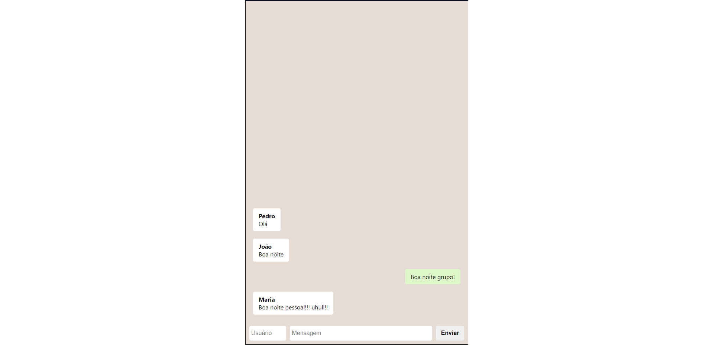

# `Projeto`
Projeto WhatsLab

# `Link`
[Clique aqui](https://folletto-whatslab.surge.sh/)

# `Descrição`
[Projeto desenvolvido na semana 6 do curso Labenu]
O Projeto WhatsLab foi desenvolvido dentro do curso Full-Stack Web Developer da Labenu, o qual consiste em requisições (via axios) para a API labeFoods, que contém informações relacionadas ao desenvolvimento de uma aplicação que simula um aplicativo semelhante ao conhecido app iFood. Este projeto foi baseado no layout layout FutureEats.
 
A documentação da API pode ser encontrada [aqui](https://documenter.getpostman.com/view/7549981/SWTEdGtT)
 
O repositório do projeto pode ser encontrado [aqui](https://github.com/future4code/Alves-labe-food5)

# `Instalando e rodando o projeto`
Fazer o clone do projeto:
- git clone link-do-repositório
Instalar as dependências:
- npm install

Rodar o projeto:
- npm run start

# `Tecnologias utilizadas`

# `Autor`
Evandro Paulo Folletto
 
  
 

# `Imagem`
### Página Chat

